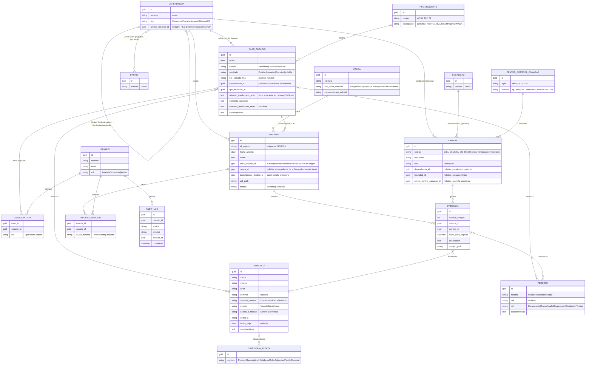

# 03 · Modelo de Dominio

## Diagrama Entidad-Relación

## El flujo real (aclarado por el equipo)

1. Ingresa un **llamado al 911** (u otro aviso). Se genera un `CasoAnalisis`:
   el equipo revisa cámaras y documenta lo que encuentra. El **Suceso** es el
   número de ese llamado — referencia interna, no judicial.
2. Si una **Dependencia** (comisaría, fiscalía, juzgado) necesita ese análisis
   por escrito para su propio expediente, **solicita un Informe Especial**
   sobre ese Caso. Ahí sí aparece la **Causa** (carátula + pieza sumarial +
   circunscripción judicial) — es el expediente *de la Dependencia*, no del
   IGE 4.0.
3. Un mismo `CasoAnalisis` puede dar origen a **0, 1 o varios** `Informe`
   (por ejemplo, si más de una dependencia pide documentación sobre el mismo
   hecho).

## Invariantes y reglas de negocio

1. Todo pedido de análisis se registra primero como `CasoAnalisis` — es la
   entidad obligatoria. `Informe` es siempre opcional y depende de un Caso
   (`Informe.caso_analisis_id` es NOT NULL) **salvo para Informes
   migrados** (`Informe.origen = Migrado`, ver HU-04 épica 01 y sección
   "Decisiones ya resueltas" más abajo), donde es nullable por diseño.
2. `Informe.id_registro` es único en todo el sistema.
3. `Informe.causa_id` es nullable pero típicamente se completa: es el
   expediente propio de la `Dependencia` que solicitó el informe.
4. `CasoAnalisis.nro_llamado_911` es nullable — no todo pedido llega por
   llamada al 911 (puede ser un aviso interno o pedido directo de un
   comisario).
5. Un `Vehiculo` puede tener 0 o más `CategoriaAlerta` simultáneas
   (ej. Robado + Narcotráfico).
6. `Vehiculo.dominio` es nullable y lleva `dominio_certeza` — nunca debe
   exigirse formato estricto de patente.
7. Una `Evidencia` pertenece a exactamente un `Informe`; puede vincular
   0..N `Vehiculo` y 0..N `Persona`.
8. `InformeAnalista` requiere al menos un registro con `rol_en_informe =
   Firmante` antes de que `Informe.estado` pueda pasar a `Publicado`.
9. Toda lectura de un `CasoAnalisis`, `Informe`, `Vehiculo` o `Persona` por
   parte de un `Usuario` queda registrada en `AuditLog`.
10. `Dependencia.nombre` es único en todo el sistema.
11. Un `Dependencia` puede tener 0 o más `Barrio` asignados (jurisdicción
    geográfica), sin importar su `Tipo` — no hay restricción en el dominio
    por tipo de Dependencia; la UI simplemente no lo exige para Fiscalía o
    Juzgado.
12. `Camara.dependencia_id` es nullable — una Cámara LPR en ruta o en un
    paso limítrofe puede no pertenecer a ninguna Dependencia.
13. `Barrio.nombre` es único — se reutiliza el mismo `Barrio` entre
    distintas Dependencias en vez de duplicar el nombre por cada una.
14. `Dependencia.UnidadRegionalId` es nullable y solo tiene sentido para
    `Tipo = Comisaria` (una Comisaría pertenece a una UR); el dominio no
    restringe por `Tipo` — igual que con `Barrio`, la UI simplemente no lo
    ofrece para Fiscalía/Juzgado. La Dependencia referenciada debe tener
    `Tipo = UnidadRegional` (se valida en el Handler, no con FK check
    constraint, para message de error claro).
15. `Localidad.nombre` es único.
16. `CentroControlCamaras.sigla` es único (ej. `CCCSL`).
17. `Camara.Codigo` **no** es único — a diferencia de `Dependencia.nombre`,
    `Barrio.nombre` y `Localidad.nombre`. El dato real trae códigos
    repetidos entre cámaras de una misma instalación agrupada.
18. `Camara.LocalidadId` y `Camara.CentroControlCamarasId` son nullables —
    igual criterio que `DependenciaId`: una Cámara puede darse de alta sin
    esos datos si todavía no se relevaron.

## Alcance de migración de datos (confirmado)

| Fuente | ¿Se migra? | Notas |
|---|---|---|
| `ANALITICA_2026.xlsx` (Casos de Análisis históricos) | **No** — el equipo sigue llevándolo en Excel en paralelo | El sistema nuevo arranca registrando Casos desde cero a partir de su puesta en producción |
| `Relevamiento_Dominios_cargados_Hik_Central.xlsx` | **Sí** | Deduplicar entre hojas repetidas (`VEHICULOS SL` ≈ `Hoja 7`); descartar hojas vacías |
| PDFs de Informes en Drive | **Sí** | Ver ADR-004 — parser por plantilla, sin OCR |
| `docs/camaras.xlsx` (relevamiento de Cámaras) | **Sí** | 851 filas con datos reales (de 1015 filas en el `UsedRange`; las 164 restantes están completamente vacías — residuo de formato de Excel, no datos perdidos): `ID` (Codigo, no único), `Ubicacion`, `Localidad`, `Monitoreo` (sigla de CentroControlCamaras), `Unidad Regional`, `Jurisdiccion` (nombre de Dependencia tipo Comisaría). Normalizar antes de importar: `UR1` → `UR 1` (inconsistencia de formato encontrada en el origen), espacios dobles en nombres de Jurisdicción. |

## Decisiones ya resueltas

- **`Informe.caso_analisis_id` es nullable** (confirmado, HU-04 de la
  épica 01): los Informes migrados desde PDFs históricos quedan sin
  `CasoAnalisis` de origen, porque el histórico de Casos no se migra (ver
  tabla de arriba). Se agregó `Informe.origen` (`CargaIndividual` |
  `Migrado`) para distinguirlos — la invariante 1 ("`Informe` depende de
  un `Caso`") rige solo para `origen = CargaIndividual`; para
  `origen = Migrado`, `caso_analisis_id` es null por diseño, no un dato
  faltante. En el dominio, `Informe.CrearMigrado(...)` es el único punto
  de alta que permite esto — el constructor normal sigue exigiendo un
  `CasoAnalisis` real.
