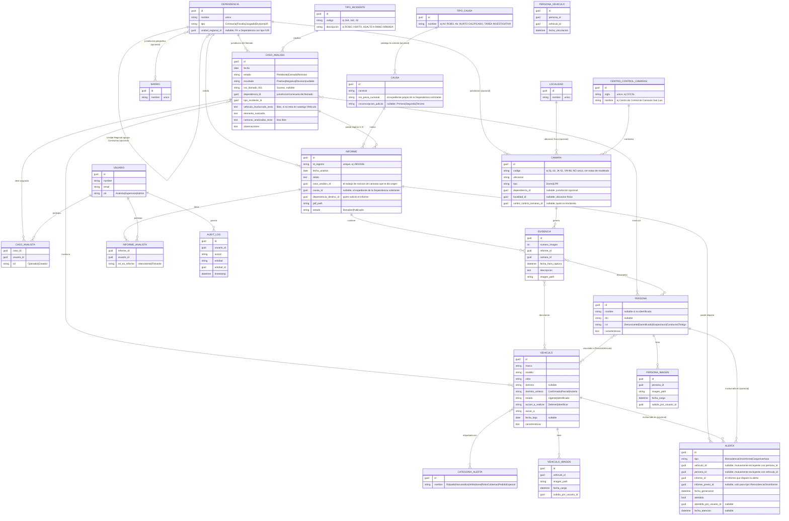

# 03 · Modelo de Dominio

## Diagrama Entidad-Relación

## El flujo real (aclarado por el equipo)

1. Ingresa un **llamado al 911** (u otro aviso). Se genera un `CasoAnalisis`:
   el equipo revisa cámaras y documenta lo que encuentra. El **Suceso** es el
   número de ese llamado — referencia interna, no judicial.
2. Si una **Dependencia** (comisaría, fiscalía, juzgado) necesita ese análisis
   por escrito para su propio expediente, **solicita un Informe Especial**
   sobre ese Caso. Ahí sí aparece la **Causa** (carátula + pieza sumarial +
   circunscripción judicial) — es el expediente *de la Dependencia*, no del
   IGE 4.0.
3. Un mismo `CasoAnalisis` puede dar origen a **0, 1 o varios** `Informe`
   (por ejemplo, si más de una dependencia pide documentación sobre el mismo
   hecho).

## Invariantes y reglas de negocio

1. Todo pedido de análisis se registra primero como `CasoAnalisis` — es la
   entidad obligatoria. `Informe` es siempre opcional y depende de un Caso
   (`Informe.caso_analisis_id` es NOT NULL) **salvo para Informes
   migrados** (`Informe.origen = Migrado`, ver HU-04 épica 01 y sección
   "Decisiones ya resueltas" más abajo), donde es nullable por diseño.
2. `Informe.id_registro` es único en todo el sistema.
3. `Informe.causa_id` es nullable pero típicamente se completa: es el
   expediente propio de la `Dependencia` que solicitó el informe.
4. `CasoAnalisis.nro_llamado_911` es nullable — no todo pedido llega por
   llamada al 911 (puede ser un aviso interno o pedido directo de un
   comisario).
5. Un `Vehiculo` puede tener 0 o más `CategoriaAlerta` simultáneas
   (ej. Robado + Narcotráfico).
6. `Vehiculo.dominio` es nullable y lleva `dominio_certeza` — nunca debe
   exigirse formato estricto de patente.
7. Una `Evidencia` pertenece a exactamente un `Informe`; puede vincular
   0..N `Vehiculo` y 0..N `Persona`.
8. `InformeAnalista` requiere al menos un registro con `rol_en_informe =
   Firmante` antes de que `Informe.estado` pueda pasar a `Publicado`.
9. Toda lectura de un `CasoAnalisis`, `Informe`, `Vehiculo` o `Persona` por
   parte de un `Usuario` queda registrada en `AuditLog`.
10. `Dependencia.nombre` es único en todo el sistema.
11. Un `Dependencia` puede tener 0 o más `Barrio` asignados (jurisdicción
    geográfica), sin importar su `Tipo` — no hay restricción en el dominio
    por tipo de Dependencia; la UI simplemente no lo exige para Fiscalía o
    Juzgado.
12. `Camara.dependencia_id` es nullable — una Cámara LPR en ruta o en un
    paso limítrofe puede no pertenecer a ninguna Dependencia.
13. `Barrio.nombre` es único — se reutiliza el mismo `Barrio` entre
    distintas Dependencias en vez de duplicar el nombre por cada una.
14. `Dependencia.UnidadRegionalId` es nullable y solo tiene sentido para
    `Tipo = Comisaria` (una Comisaría pertenece a una UR); el dominio no
    restringe por `Tipo` — igual que con `Barrio`, la UI simplemente no lo
    ofrece para Fiscalía/Juzgado. La Dependencia referenciada debe tener
    `Tipo = UnidadRegional` (se valida en el Handler, no con FK check
    constraint, para message de error claro).
15. `Localidad.nombre` es único.
16. `CentroControlCamaras.sigla` es único (ej. `CCCSL`).
17. `Camara.Codigo` **no** es único — a diferencia de `Dependencia.nombre`,
    `Barrio.nombre` y `Localidad.nombre`. El dato real trae códigos
    repetidos entre cámaras de una misma instalación agrupada.
18. `Camara.LocalidadId` y `Camara.CentroControlCamarasId` son nullables —
    igual criterio que `DependenciaId`: una Cámara puede darse de alta sin
    esos datos si todavía no se relevaron.
19. Un `Vehiculo` puede tener 0 o más `VehiculoImagen`; no hay límite
    máximo de fotos por Vehículo. Se administran desde la ficha del propio
    Vehículo, no desde un Informe.
20. Una `Persona` puede tener 0 o más `PersonaImagen`; mismo criterio que
    la invariante 19.
7.a `Evidencia.ImagenPath`/`Evidencia.CamaraId` son opcionales — además de
    nacer del parseo de un PDF, una `Evidencia` puede crearse manualmente
    desde la ficha del Informe para vincular un `Vehiculo`/`Persona` sin
    archivo de imagen asociado (`ImagenPath = null`, `CamaraId = null`).
    En ese caso, `NumeroImagen` se autoasigna como
    `MAX(NumeroImagen del Informe) + 1` — no cambia la invariante de que
    `NumeroImagen` sea positivo y único por Informe, solo agrega una regla
    de asignación automática para el alta manual.
21. `PersonaVehiculo` vincula una `Persona` y un `Vehiculo` de forma
    directa e independiente de los `Informe`/`CasoAnalisis` en los que
    ambos puedan aparecer — el par `(PersonaId, VehiculoId)` es único.
22. `Alerta.VehiculoId` y `Alerta.PersonaId` son mutuamente excluyentes —
    exactamente uno de los dos debe estar presente. `InformePrevioId` solo
    aplica cuando `Tipo = ReincidenciaOtroInforme`. `Alerta` no tiene
    destinatario individual: es visible para todo `Usuario` con rol
    Analista/Supervisor/Admin, y cualquiera de esos roles puede marcarla
    atendida, no solo quien la generó.

## Alcance de migración de datos (confirmado)

| Fuente | ¿Se migra? | Notas |
|---|---|---|
| `ANALITICA_2026.xlsx` (Casos de Análisis históricos) | **No** — el equipo sigue llevándolo en Excel en paralelo | El sistema nuevo arranca registrando Casos desde cero a partir de su puesta en producción |
| `Relevamiento_Dominios_cargados_Hik_Central.xlsx` | **Sí** | Deduplicar entre hojas repetidas (`VEHICULOS SL` ≈ `Hoja 7`); descartar hojas vacías |
| PDFs de Informes en Drive | **Sí** | Ver ADR-004 — parser por plantilla, sin OCR |
| `docs/camaras.xlsx` (relevamiento de Cámaras) | **Sí** | 851 filas con datos reales (de 1015 filas en el `UsedRange`; las 164 restantes están completamente vacías — residuo de formato de Excel, no datos perdidos): `ID` (Codigo, no único), `Ubicacion`, `Localidad`, `Monitoreo` (sigla de CentroControlCamaras), `Unidad Regional`, `Jurisdiccion` (nombre de Dependencia tipo Comisaría). Normalizar antes de importar: `UR1` → `UR 1` (inconsistencia de formato encontrada en el origen), espacios dobles en nombres de Jurisdicción. |

## Decisiones ya resueltas

- **`Informe.caso_analisis_id` es nullable** (confirmado, HU-04 de la
  épica 01): los Informes migrados desde PDFs históricos quedan sin
  `CasoAnalisis` de origen, porque el histórico de Casos no se migra (ver
  tabla de arriba). Se agregó `Informe.origen` (`CargaIndividual` |
  `Migrado`) para distinguirlos — la invariante 1 ("`Informe` depende de
  un `Caso`") rige solo para `origen = CargaIndividual`; para
  `origen = Migrado`, `caso_analisis_id` es null por diseño, no un dato
  faltante. En el dominio, `Informe.CrearMigrado(...)` es el único punto
  de alta que permite esto — el constructor normal sigue exigiendo un
  `CasoAnalisis` real.
- **`MigracionPendiente` (entidad nueva, no un estado de `Informe`)**:
  cuando el parser reconoce el ID Registro pero no la Fecha de Análisis
  durante una migración masiva (HU-04), el PDF no se descarta — se guarda
  en MinIO y se persiste una `MigracionPendiente` con los demás datos ya
  extraídos (ID Registro, Causa, Relato, Vehículos/Personas/Evidencias
  reconocidos, Dependencia destino elegida en el lote). El Administrador
  la completa desde una pantalla dedicada (`/informes/migrar/pendientes`)
  ingresando la fecha; al confirmar, se crea el `Informe` real vía
  `Informe.CrearMigrado(...)` (mismo camino que la migración exitosa) y la
  `MigracionPendiente` se borra. No se modeló como un estado nuevo de
  `EstadoInforme` porque `Informe.FechaAnalisis` es un campo no-nullable
  con invariantes propias (`CorregirFechaAnalisis` ya asume que el
  `Informe` existe) — evita ensuciar el dominio de `Informe` con un paso
  transitorio de un proceso operativo de carga masiva.
- **`MigracionPendiente.IdRegistro` es nullable** (extensión del punto
  anterior): también se crea una `MigracionPendiente` cuando el parser NO
  reconoce el ID Registro (antes ese caso se descartaba sin persistir
  nada, único caso de la migración masiva que seguía perdiendo el PDF).
  Como el índice único de `MigracionPendiente.IdRegistro` solo tiene
  sentido para evitar duplicar el mismo ID Registro entre dos
  migraciones pendientes, se mapea como índice único **parcial**
  (`WHERE "IdRegistro" IS NOT NULL`) — Postgres no colisiona valores
  `NULL` en un índice único por defecto, pero se declara explícito en la
  configuración de EF Core para que no dependa de ese comportamiento
  implícito sin documentar. La pantalla `/informes/migrar/pendientes`
  pide completar el ID Registro (si falta) y la Fecha de Análisis (si
  falta) en el mismo formulario — antes de crear el `Informe`, valida
  que el ID Registro ingresado no choque con uno ya existente (mismo
  chequeo que ya hacía el Handler para el caso de fecha faltante).
- **`Informe.IdRegistro` se puede corregir en edición (HU-02)**: se agregó
  `Informe.CorregirIdRegistro(...)`, con la misma regla de inmutabilidad
  que el resto de los campos editables (`Estado == Publicado` lo
  bloquea) más un chequeo explícito de duplicado contra la invariante 2
  (`Informe.id_registro` es único en todo el sistema) — necesario porque
  se descubrió en producción que el parser puede reconocer un ID
  Registro equivocado (el nombre de archivo no siempre coincide con el
  contenido real del PDF, ver `project_migracion_pendiente_2026-08-06`
  en memoria del proyecto) y hasta ahora no había forma de corregirlo sin
  recrear el Informe entero.
- **Matching de `Causa` por N° de Pieza Sumarial al editar un Informe
  (HU-02)**: antes, `EditarInformeCommandHandler` creaba una `Causa`
  nueva cada vez que se completaban los 3 campos, sin buscar si ya
  existía una — dos Informes sobre el mismo expediente judicial real
  terminaban con dos filas de `Causa` distintas y desvinculadas entre
  sí. Se eligió el **N° de Pieza Sumarial** como clave de matching (no
  la carátula) porque es el identificador judicial más parecido a una
  clave natural — la carátula es texto libre con variaciones de
  transcripción entre PDFs distintos del mismo expediente. Si el N° de
  Pieza Sumarial ingresado coincide **exacto** con una `Causa`
  existente, el Informe se vincula a esa `Causa` en vez de crear una
  nueva. Si no hay match exacto, la UI de edición sugiere las `Causa`
  existentes con carátula parecida (similaridad de texto vía
  `pg_trgm`/`similarity()` de Postgres — mismo mecanismo ya disponible
  en la extensión `unaccent` usada por Búsqueda combinada, ver
  `project_busqueda_combinada_2026-07-31` en memoria) para que el
  usuario elija en vez de crear sin querer un duplicado; sigue pudiendo
  crear una `Causa` nueva si ninguna sugerencia corresponde.
- **Matching de `Causa` por N° de Pieza Sumarial también en la migración
  masiva (HU-04)**: extensión del punto anterior tras uso real —
  `MigrarInformesCommandHandler` (camino "Exitoso") y
  `CrearInformeDesdeMigracionPendienteCommandHandler` ahora intentan el
  mismo matching exacto por N° de Pieza Sumarial que la edición manual,
  usando `CausaCaratula`/`PiezaSumarial` ya extraídos por el parser. A
  diferencia de la edición manual, acá **nunca se crea una Causa
  nueva** — el parser no extrae Circunscripción judicial (no es un
  patrón presente en el texto del PDF, ver skill `pdf-informe-parser`) y
  `Causa` exige los 3 campos no vacíos, así que sin match exacto el
  Informe migrado sigue naciendo sin Causa, igual que antes (se completa
  después vía HU-02, donde si pueden aparecer sugerencias por
  similaridad). El helper `CausaMatcher`
  (`Application/Common/Services`) centraliza la búsqueda por Pieza
  Sumarial para no duplicarla entre los tres puntos donde se persiste
  una Causa (edición manual, migración masiva exitosa, y completar una
  `MigracionPendiente`). Hallazgo del `security-reviewer`: a diferencia
  de la edición manual (donde el usuario ve la sugerencia y confirma
  antes de vincular), acá **ningún humano revisa la vinculación en el
  momento** — una colisión accidental de N° de Pieza Sumarial (parser
  extrayendo mal el dato de un PDF, coincidiendo por casualidad con una
  Causa real no relacionada) vincularía en silencio al expediente
  equivocado. Mitigado registrando `AuditLog("CausaAutoAsignadaMigracion",
  ...)` en cada auto-vinculación y agregando
  `/informes/causas-auto-asignadas` (Admin) — reporte de revisión
  posterior, ver `ListarCausasAutoAsignadasQuery` — en vez de dejarlo
  como riesgo aceptado sin mecanismo de verificación. **Riesgo aceptado
  explícitamente** (confirmado con el usuario, segunda pasada del
  `security-reviewer`): la mitigación es detectiva, no preventiva — el
  Informe queda operable con la Causa auto-asignada desde el momento en
  que se crea, y el reporte no distingue ítems ya revisados de nuevos
  (crece indefinidamente, sin botón de "marcar revisado"). Aceptable
  mientras el volumen de migraciones masivas sea manejable a ojo; si se
  vuelve incómodo, agregar esa marca es la siguiente iteración natural.
- **`TipoCausa` (entidad nueva, catálogo preseteado de carátulas)**: hasta
  acá, la Carátula de una `Causa` se tipeaba siempre como texto libre en
  `EditarInformeCommandHandler` — el usuario reportó que esto generaba
  inconsistencias de transcripción (mismo problema que ya motivó el
  matching por N° de Pieza Sumarial en vez de por carátula, ver más
  arriba). `TipoCausa` (`Nombre` único, sin más campos) es un catálogo
  simple administrado por el Admin (mismo patrón CRUD que `Dependencia`)
  — la pantalla de edición ahora ofrece un `<select>` con el catálogo en
  vez de un `<input>` de texto libre para la Carátula. **No es una FK
  desde `Causa`**: `Causa.Caratula` sigue siendo `string` — `TipoCausa`
  solo alimenta el `<select>` de la UI (el valor elegido se copia como
  texto al crear/matchear la `Causa`, igual que antes). Se decidió así
  para no romper el modelo de `Causa` existente (que no tiene ningún
  campo `TipoCausaId`) ni el matching ya implementado por Pieza
  Sumarial, que sigue intacto. Si el Tipo de Causa real no está en el
  catálogo, se agrega primero desde un atajo inline en la edición del
  Informe — mismo criterio ya usado para `Dependencia`.
  Migrado el catálogo histórico real desde
  `docs/docuemntación-legacy/causes.csv` (82 filas activas, excluidas 3
  soft-deleted por `deleted_at`) — **esto no es el mismo archivo que
  contiene el catálogo de `TipoIncidente` pendiente de migrar** (ver
  `docs/08-plan-implementacion.md`, "Deuda registrada"); a pesar del
  nombre del archivo ("causes"), el contenido real (carátulas genéricas
  tipo "AV. ROBO") corresponde a `TipoCausa`, no a la deuda de
  `TipoIncidente` (que necesita códigos numéricos tipo "164 - ROBO",
  dato que este CSV no tiene).
- **`Causa.CircunscripcionJudicial` pasa a ser opcional** (cambio de
  invariante, hallazgo del usuario probando la edición): hasta acá era
  obligatoria (constructor de `Causa` la exigía junto con Carátula y
  Pieza Sumarial), pero varios expedientes reales no la especifican —
  con el campo obligatorio, `EditarInformeCommandHandler` ni siquiera
  creaba/vinculaba la `Causa` si faltaba, perdiendo Carátula y Pieza
  Sumarial también aunque esos dos sí estuvieran completos. Ahora
  `Causa.CircunscripcionJudicial` es `string?`, y el constructor solo
  exige Carátula y Pieza Sumarial no vacíos — el "los 3 campos o
  ninguno" pasa a ser "los 2 obligatorios, el tercero opcional".
  Aplicado en los **3 flujos** que crean/editan `Causa` (decisión
  explícita del usuario, consistencia entre todos): edición de un
  Informe existente (`EditarInformeCommandHandler`, HU-02), carga
  individual de un PDF (`ConfirmarCargaInformeCommandHandler`, HU-01) y
  generación manual de un Informe desde un Caso de Análisis
  (`GenerarInformeDesdeCasoCommandHandler`, HU-03, sin PDF de por
  medio). En la UI (`Editar.razor`), el campo se convirtió de
  `<input>` de texto libre a un `<select>` con 3 valores fijos
  (`Primera`, `Segunda`, `Tercera`) más la opción vacía — mismo
  criterio que `TipoCausa`: si el valor ya guardado en una `Causa`
  existente no matchea ninguna de las 3 opciones (dato histórico como
  "Primera Circunscripción Judicial", con texto libre previo a este
  cambio), el `<select>` inyecta una opción extra con el valor actual
  para no perderlo en silencio al cargar la página.
- **`Causa.NroPiezaSumarial` pasa a ser opcional** (cambio de invariante,
  hallazgo del usuario editando Informes de Narcotráfico): hasta acá era
  obligatorio junto con la Carátula — pero hay Dependencias/tipos de
  análisis (ej. Narcotráfico) que directamente no aportan un N° de Pieza
  Sumarial real. Como el campo era obligatorio, el usuario tipeaba un
  valor de referencia fijo (`--/--`) para no dejarlo vacío — y como
  `CausaMatcher` matchea por **N° de Pieza Sumarial exacto** (ver más
  arriba), todos los Informes con ese mismo placeholder terminaban
  compartiendo la primera `Causa` creada con ese "número", pisando su
  Carátula real por la de otro Informe sin relación. Caso real detectado:
  Informes `73/2022` y `38/2023` (carátulas reales distintas) quedaron
  ambos apuntando a la misma `Causa` ("TAREA INVESTIGATIVA", `--/--`) por
  este motivo — corregido a mano tras el fix, ver
  `project_causa_sin_sumario_2026-08-12` en memoria del proyecto.

  **Aclaración de dominio importante** (explicada por el usuario): el N°
  de Pieza Sumarial **no** es un identificador de la Carátula/tipo de
  delito — es el número de expediente judicial real, con estructura
  `DDMM???/AA` (día y mes de inicio + correlativo + año, a veces con los
  4 dígitos). Dos Informes con la misma Carátula (ej. dos "AV. ROBO" en
  meses distintos) tienen Piezas Sumariales **distintas** porque son
  expedientes distintos — el matching por N° de Pieza Sumarial exacto
  sigue siendo correcto y no se tocó para ese caso. El problema era
  exclusivamente el uso de un valor de referencia repetido para "no hay
  número", que el matching no puede distinguir de una coincidencia real.

  Cambios aplicados:
  - `Causa.NroPiezaSumarial` es ahora `string?` — el constructor solo
    exige `Caratula` no vacía.
  - `CausaMatcher.ObtenerOCrearIdAsync`/`BuscarPorPiezaSumarialAsync`
    **nunca matchean cuando `nroPiezaSumarial` es null/vacío** — sin
    número no hay forma confiable de saber si es el mismo expediente,
    así que cada Informe sin Pieza Sumarial recibe su propia `Causa`
    nueva, nunca reutiliza la de otro Informe.
  - Aplicado en los mismos **3 flujos** que ya se alinearon para
    Circunscripción Judicial: `EditarInformeCommandHandler` (HU-02),
    `ConfirmarCargaInformeCommandHandler` (HU-01) y
    `GenerarInformeDesdeCasoCommandHandler` (HU-03) —
    `GenerarInformeDesdeCasoCommand.CausaNroPiezaSumarial` pasa de
    `string` a `string?`.
  - En la UI (`Editar.razor`), el campo "N° de Pieza Sumarial" admite
    quedar vacío sin escribir ningún valor de referencia — no se agrega
    ningún placeholder textual nuevo tipo "S/C", el dato real en la base
    queda `NULL`. El listado de Informes (`/informes`) sigue mostrando
    la Carátula igual si existe, con o sin número de expediente.
- **`AccionARealizar.SinAccion` (nuevo valor) + fix del KPI de alerta
  vigente del Dashboard** (pedido del usuario, con un bug preexistente
  encontrado en el camino): se necesitaba una tercera opción de "Acción a
  realizar" para un Vehículo cargado solo como referencia — ya
  identificado/vinculado a un Caso, Informe o Análisis pasado, sin ningún
  pedido activo, pero que se mantiene en el catálogo por si en el futuro
  vuelve a aparecer y hace falta ver con qué estuvo relacionado antes.

  Al investigar el impacto en el Dashboard (KPI "Vehículos con alerta
  vigente"), se encontró que ese contador ya tenía un bug preexistente
  sin relación directa con este pedido: `ObtenerResumenDashboardQueryHandler`
  solo filtraba por `Estado == EstadoVehiculo.Vigente`, ignorando por
  completo `Vehiculo.FechaBaja` — es decir, un Vehículo dado de baja
  ("fin de vigilancia activa", mecanismo ya existente desde antes) seguía
  contando como alerta vigente en el Dashboard, aunque el usuario ya
  hubiera indicado explícitamente que dejó de estar en seguimiento.
  Corregido en la misma sesión: el KPI ahora excluye todo Vehículo con
  `FechaBaja` no nula, sin importar su `AccionARealizar`.

  Decisiones de modelado (confirmadas con el usuario):
  - `AccionARealizar.SinAccion` es un tercer valor del enum, sin ninguna
    entidad ni columna nueva.
  - No afecta el mapeo de color del chip (`VehiculoChips`, ver skill
    `ige-design-system` sección 3) — ese mapeo sigue dependiendo
    únicamente de `Estado`, no de `AccionARealizar`. Un Vehículo con
    `SinAccion` pero sin `FechaBaja` sigue mostrándose como "Vigente"
    (chip rojo) en la ficha y en listados — el mecanismo para que deje
    de llamar la atención visualmente sigue siendo Dar de Baja, ahora
    corregido para que también saque del KPI del Dashboard.
  - `SinAccion` y `FechaBaja` son ortogonales: se puede cargar un
    Vehículo con `SinAccion` y sin dar de baja (aparece en listados
    normales, sin alertar activamente para acción, pero sigue en el
    contador del Dashboard hasta que se dé de baja explícitamente), o
    darlo de baja igual si además no se quiere que aparezca ahí.
